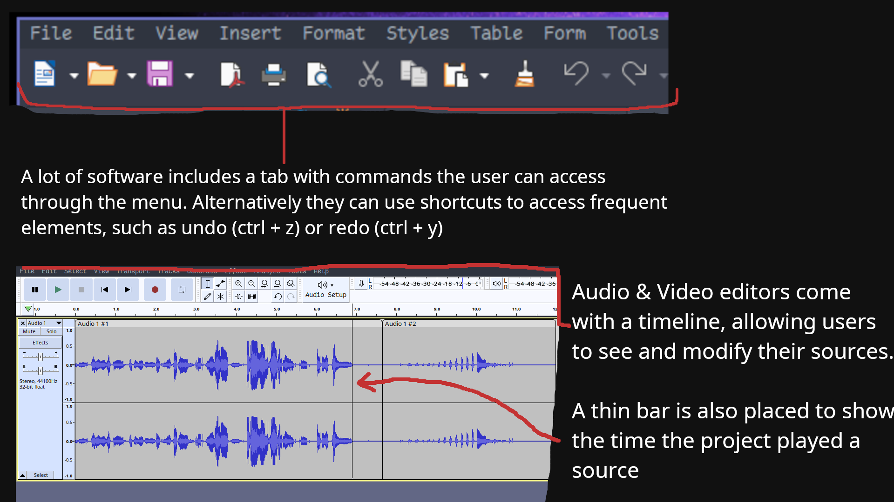

# Usability
## Flexibility & Efficiency
Keyboard shortcuts are a great way for more expierenced users to use a program 
efficinetly and with minimum hassle. Less expierenced users should have a well designed
user interface to provide the same functionality. Lastly, navigation through the
timeline should feel intuitive for all users. 

As of right now, there are plans to provide shortcuts for:
- Copy and pasting audio samples
- Undo and redo functionality
- Pausing and playing timeline
- Scrolling through timeline
- Searching for sounds

See [issue](https://github.com/it-sd/sqc-project-Lucidus115/issues/6) regarding this.

## Consistency & Standards
AudialCat should share similar elements with programs such as FL Studio and Audacity.
Users should be able to view a timeline with their audio samples. They should also
be able to trim or move around audio.

Such elements may include:
- A fully functional timeline
- Layers that you can toggle
- A way to trim or repeat audio samples

