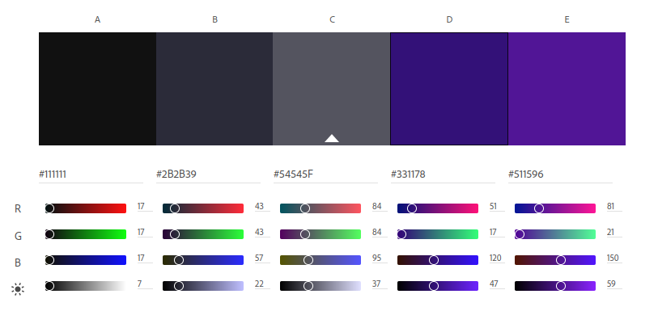

# Usability
## Flexibility & Efficiency
Keyboard shortcuts are a great way for more expierenced users to use a program 
efficinetly and with minimum hassle. Less expierenced users should have a well designed
user interface to provide the same functionality. Lastly, navigation through the
timeline should feel intuitive for all users. 

As of right now, there are plans to provide shortcuts for:
- Copy and pasting audio samples
- Undo and redo functionality
- Pausing and playing timeline
- Scrolling through timeline
- Searching for sounds

See [issue](https://github.com/it-sd/sqc-project-Lucidus115/issues/6) regarding this.

## Consistency & Standards
AudialCat should share similar elements with programs such as FL Studio and Audacity.
Users should be able to view a timeline with their audio samples. They should also
be able to trim or move around audio.

Such elements may include:
- A fully functional timeline
- Layers that you can toggle
- A way to trim or repeat audio samples

## Color Palette

This color palette has been the plan since the beginning. The darker colors make it easier on a user's eyes. They cannot be too dark, otherwise the contrast with the white font might strain the eyes. Purple is a nice color and especially compliments the darker tones. Like an artist's portrayl of a purple galaxy, the purple colors highlight exploration and creativity.

## Typography
- Arial
- Roboto

Fonts are not as important as the primary focus of this application will not be on reading. That being said, for text elements such as on the about or home page, arial will be a nice and readable font for most. The headings may favor a bold type of this font. Roboto is a fun and modern font and will be used for the workspace. Roboto font will be shown for layer names, audio titles and such should not distract the user too much.
