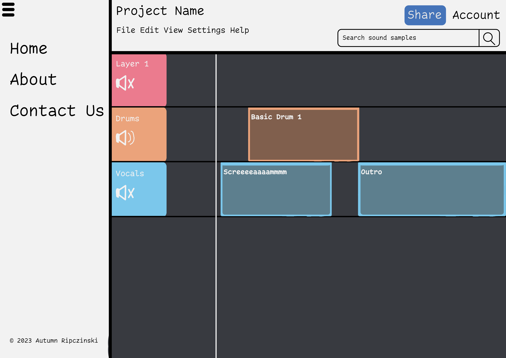
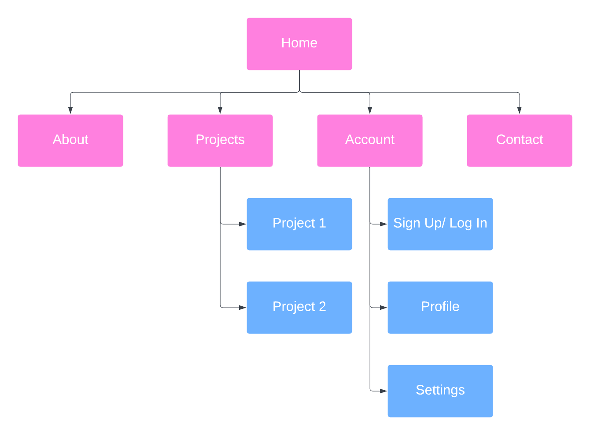

# AudialCat Studio
AudialCat Studio is a web-based music maker application. You can browse [Freesound](https://freesound.org/)'s collection of audio and import them into your own projects or upload your own sounds. The only limit is your imagination!

## Web service
- [Freesound](https://freesound.org/docs/api/) API Key
    - GET /apiv2/search/text/
    - GET /apiv2/sounds/<sound_id>/

## Database use
There will need to be a two-way relationship between the `User` table and the `Music` tables. The `User` table will contain information such as a username, password, email, and a list of project ids that they have access to. The `Music` table will contain project information such as the title and description, who has access to the project, and sound data. 

## Initial designs

